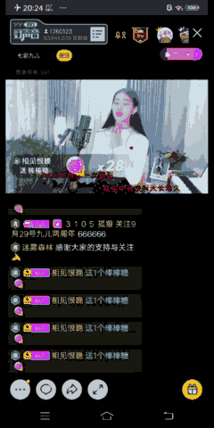
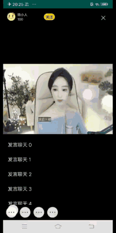

# android仿YY直播间侧滑清屏功能

[](https://jitpack.io/#wjianchen13/SlideDemo)

## 需求
YY手机直播可以通过侧滑把直播间里的一些无关的元素清除，只显示视频区域和一些主要的显示信息，如图：



## 具体实现
现在参照YY这个功能，自己通过代码实现下。
定义一个FrameLayout，里面有3个子View，分别是视频区域mBaseView，处于最底层。<br>
侧滑视图区域mDrawerView，处在中间位置。菜单视图区域 mMenuView，处于最顶层。<br>
完整的结构应该是这样
```Java
<FrameLayout >
    <mBaseView />
    <mDrawerView />
    <mMenuView />
</FrameLayout>
```

其中mBaseView是保持不动的，如果需要保持界面元素不随滑动清除，应该放置在这一层。<br>
mDrawerView里面的元素都是可以随滑动清除的。mMenuView就是一个侧边栏菜单。

实现原理也很简单，是通过ViewDragHelper控制不同层级View的滑动，ViewDragHelper这里就不介绍了，可以参照网上的资料进行了解<br>
https://www.jianshu.com/p/5670a67f0b19<br>
https://www.jianshu.com/p/e4d1f88ca922<br>
具体实现效果如图：



## 使用方法
step 1：
    在项目build.gradle添加JitPack 仓库
    ```Groovy
    repositories {
        ...
        maven { url 'https://jitpack.io' }
    }
    ```

step 2:
    在使用module的build.gradle添加依赖
    dependencies {
        ...
        implementation 'com.github.wjianchen13:SlideDemo:1.0.0'
    }
step 3：
    在xml使用
    <?xml version="1.0" encoding="utf-8"?>
    <com.cold.library.SlideLayout xmlns:android="http://schemas.android.com/apk/res/android"
        xmlns:app="http://schemas.android.com/apk/res-auto"
        android:layout_width="match_parent"
        android:id="@+id/slide_layout"
        android:layout_height="match_parent"
        app:menu_gesture="false">

        <RelativeLayout
            android:id="@+id/rlyt_base"
            android:layout_width="match_parent"
            android:layout_height="match_parent">

        </RelativeLayout>

        <RelativeLayout
            android:id="@+id/rlyt_drawer"
            android:layout_width="match_parent"
            android:layout_height="match_parent" >

        </RelativeLayout>
        <LinearLayout
            android:id="@+id/llyt_menu"
            android:layout_width="200dp"
            android:layout_height="match_parent">

        </LinearLayout>

    </com.cold.library.SlideLayout>

## license

    Copyright 2019 wjianchen13

    Licensed under the Apache License, Version 2.0 (the "License");
    you may not use this file except in compliance with the License.
    You may obtain a copy of the License at

       http://www.apache.org/licenses/LICENSE-2.0

    Unless required by applicable law or agreed to in writing, software
    distributed under the License is distributed on an "AS IS" BASIS,
    WITHOUT WARRANTIES OR CONDITIONS OF ANY KIND, either express or implied.
    See the License for the specific language governing permissions and
    limitations under the License.


