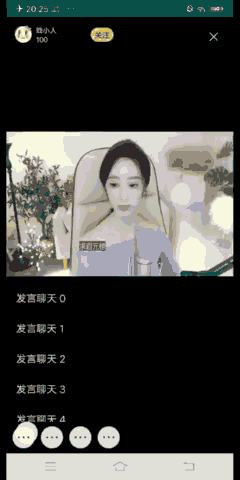

# android仿YY直播间侧滑清屏功能
## 需求
YY手机直播可以通过侧滑把直播间里的一些无关的元素清除，只显示视频区域和一些主要的显示信息，如图：


## 具体实现
现在参照YY这个功能，自己通过代码实现下。
定义一个FrameLayout，里面有3个子View，分别是视频区域mBaseView，处于最底层。
侧滑视图区域mDrawerView，处在中间位置。菜单视图区域 mMenuView，处于最顶层。
完整的结构应该是这样
```Java
<FrameLayout >
    <mBaseView />
    <mDrawerView />
    <mMenuView />
</FrameLayout>
```

其中mBaseView是保持不动的，如果需要保持界面元素不随滑动清除，应该放置在这一层。
mDrawerView里面的元素都是可以随滑动清除的。mMenuView就是一个侧边栏菜单。

实现原理也很简单，是通过ViewDragHelper控制不同层级View的滑动，ViewDragHelper这里就不介绍了，可以参照网上的资料进行了解
https://www.jianshu.com/p/5670a67f0b19
https://www.jianshu.com/p/e4d1f88ca922
具体实现效果如图：



本例demo


